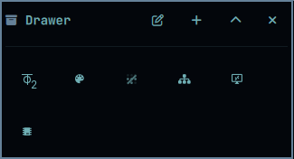

# Omarchy Drawer 🗄️✨

> **A collapsible hover drawer and quick-launch dock for grouping secondary bar plugins and widgets without cluttering your Omarchy top bar.**



## What it does
- **Declutters your top bar**: Group 5 to 15 secondary widgets (TekScan, Omarchroma, ZeroTier, OmaVNC, WhatsApp, etc.) into a single, compact expander glyph.
- **Hover & Click Expanders**: Move your cursor over the expander button to smoothly slide open an inline tray of glowing icons.
- **Floating Mini-Dock**: Optionally display items in a modern floating pill panel with keyboard number shortcuts (`1..9`).
- **Live Theme Tinting**: Inherits Omarchy theme accents with dimmed inactive states and responsive animations.
- **GUI Management**: Right-click the expander to easily check or uncheck which plugins go inside the drawer.

## Installation (Local Development)
```bash
ln -s /home/evcode/Proyectos/omarchy-drawer ~/.config/omarchy/plugins/evcode.drawer
omarchy-shell shell rescanPlugins
omarchy plugin enable evcode.drawer
```

## CLI Usage
```bash
omarchy-drawer toggle
omarchy-drawer add tiertek.tekscan
omarchy-drawer remove tiertek.tekscan
```

## License
MIT © evcode
